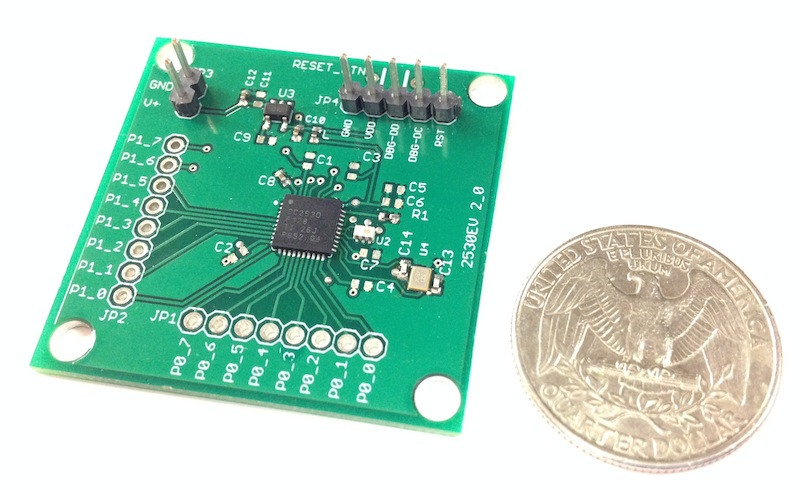

# CC2530EV Reference Design

## Specification
- TI CC2530F256 with 256KB Flash and 8kB RAM
- Slim debugger connector, need an adapter to use with TI CC Debugger
- 2x 8-pins interface headers (P0 and P1)
- 1x power headers
- 1x reset button
- Board dimension 40mm x 40mm