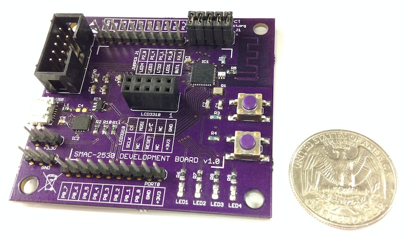

# SMAC-2530 Reference Design

## Specification
- TI CC2530F256 with 256KB Flash and 8kB RAM
- TI CC Debugger compatible connector
- FTDI FT230x USB to serial converter
- 2x 10-pins interface headers (P0 and P1)
- 3x power headers
- 1x LCD3310 interface
- 4x LEDs
- 1x push button
- 1x reset button
- Board dimension 62.5mm x 57.5mm