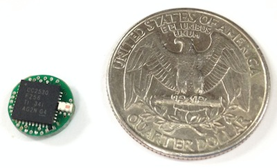

# CC2530 Reference Design

## Specification
- TI CC2530F256 with 256KB Flash and 8kB RAM
- Require an antenna made of a piece of 31.25mm wire
- Solderable pads for debugging/programming with TI CC Debugger
- Solderable pads for signal interfacing
- Board diameter 10mm